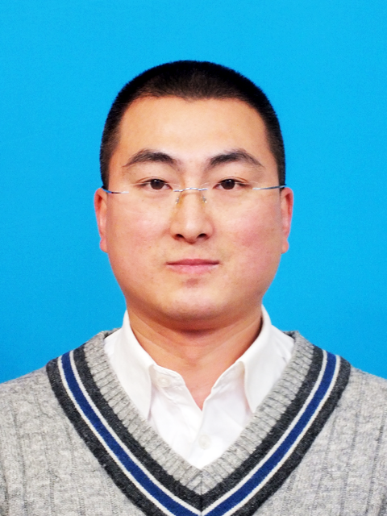

</head>
<body>

<h1>杨光 (Guang Yang)</h1>

<table class="imgtable"><tr><td>
</a>&nbsp;</td>
<td align="left">
男，1981年生，党员，硕士生导师，讲师。博士毕业于哈尔滨工程大学水声工程学院水声工程专业，CSC全国海选新加坡南洋理工大学博士后，CSC国家公派西澳大学联培博士。 
手机: 13969816066   
邮箱: edit231@163.com    
 
</td></tr></table>

现为国家自然科学基金评审专家，IEEE Sensors Journal，SCIENCE CHINA Information Sciences等SCI期刊审稿人，青岛西海岸新区梧桐树聚才计划。从事运动海洋通信、智能海洋通信的研究。近5年，主持基金6项，其中国防科技创新特区项目（原国家863计划军口项目）1项、国家自然科学基金常规面上项目1项，获批国家和省市级纵向经费约为129万。参与863计划重大项目等多项项目。已完成HX产品级海洋通信技术，海水中5.5 km可靠运动通信，带宽利用率0.94 bps/Hz。已发表SCI/EI论文近30篇。   
<h2>教育经历</h2>
<ul>
<li>
2013.9 - 2016.12    哈尔滨工程大学               运动水声通信             殷敬伟教授

<li>
2007.9 - 2010.7      中国海洋大学             水声通信、信道估计           黎明教授

<li>
2000.9 - 2004.7     黑龙江科技大学                  自动化 
                
</li>
</ul>
<h2>工作经历</h2>
<ul>
<li>
2016.12 - 至今                   青岛理工大学                          运动水声通信

<li>
2010.7 - 2012.11             山东海洋仪器仪表研究所                 水下目标探测及定位

<li>
2004.8 - 2007.9                  青岛自来水公司                         一级调度员   
              
</li>
</ul>
<h2>国外经历</h2>
<ul>
<li>
 2022.2 - 至今                  新加坡南洋理工大学                 CSC全国海选博士后  

<li>
2014.9 - 2016.9                     西澳大学                        国家公派联培博士     
  <i>国外导师David Huang为终身教授，现为无线通信信号处理实验室主任。</i>                

<li>
2014.5.3 - 2014.5.10           美国167届声学国际会议            宣读研究报告，小组讨论发言  
 
</li>
</ul>
<h2>主持项目</h2>
<ul>
<li>
[1].	快时变信道下基于高斯消息传递和无损信息融合的低复杂度可靠水声通信，（山东省自然科学基金面上项目），2021.1-2023.12，10万，主持，ZR2020MF010，在研 

</li>
</ul>
<ul>
<li>
[2].	基于广义近似消息传递的高速高可靠变速运动水声多用户通信理论和方法，（青岛市科技计划应用基础研究青年专项），2019.8-2021.7，10万，主持，19-6-2-4-cg，已结题   

</li>
</ul>
<ul>
<li>
[3].	******通信技术，（国防科技创新特区项目，原国家863计划军口项目），2018.12-2021.9，80万，主持，18-H863-**-**-***-***-**，已结题

</li>
</ul>
<ul>
<li>
[4].	基于盲双迭代策略的高可靠变速移动水声多用户通信理论和方法，（国家自然科学基金常规面上项目），2018.1-2018.12，18.5万（直接16万+间接2.5万），主持，61771271，已结题

</li>
</ul>
<ul>
<li>
[5].	基于最小均方误差估计的水声移动差分虚拟盲自适应多址干扰抑制算法研究，（山东省自然科学基金培养项目），2016.11-2018.6，5万，主持，ZR2016FP06，提前结题 

</li>
</ul>
<ul>
<li>
[6].	基于整机最小均方误差估计策略的变速移动盲水声多用户通信技术，（水声技术国防重点实验室开放基金），2019.1-2019.12，5万，主持，SSKF2018008，已结题 

</li>
</ul>
<h2>论文代表作</h2>
<ul>
  <li>
[1].	<b>Guang Yang</b>, Qinghua Guo, Zhengchang Qin, Defeng Huang, Qi Yan. “Belief Propagation Based Low-complexity Channel Estimation and Detection for Underwater Acoustic Communications with Moving Transceivers [J],” IEEE Journal of Oceanic Engineering, accepted, 2021. 海洋工程top1顶刊. (SCI, JCR-1区) 

</li>
</ul>
 <ul>
<li>
[2].	<b>Guang Yang</b>, Qinghua Guo, Hanxue Ding, Qi Yan, Defeng Huang. “Joint message-passing-based bidirectional channel estimation and equalization with superimposed training for underwater acoustic communications [J],” IEEE Journal of Oceanic Engineering, vol.46, no.4, pp. 1463-1476, 2021. 海洋工程top1顶刊. (SCI: 000706820200029, JCR-1区)  

</li>
</ul>
 <ul>
<li>
[3].	<b>杨光</b>, 丁寒雪等. 基于叠加训练序列和低复杂度频域Turbo均衡的时变水声信道估计和均衡. 电子与信息学报[J]. 43(3): 850-856, 2021. (EI: 20211310142059).  JEIT 早知道丨2021-6-4 | 周五 | 编辑头条推荐. 

</li>
</ul>
 <ul>
<li>
[4].	<b>Guang Yang</b>, Liang Wang, Peiyue Qiao, Junyan Liang, Tong Chen. “Joint multiple turbo equalization for harsh time-varying underwater acoustic channels [J],” IEEE Access, 9, 82364-82372, 2021. (SCI: 000674083600001, JCR-1区)   

</li>
</ul>
 <ul>
<li>
[5].	<b>Guang Yang</b>, Tailian Liu, Hanxue Ding, Qi Yan, Xinjie Wang. “Joint channel estimation and generalized approximate messaging passing based equalization for underwater acoustic communications [J],” IEEE Access, 9, 56757-56764, 2021. (SCI: 000641934300001, JCR-1区)   

</li>
</ul>
  <ul>
<li>
[6].	<b>Guang Yang*</b>, Jingwei Yin, Defeng Huang, Lu Jin, Huanling Zhou. “A Kalman filter-based blind adaptive multi-user detection algorithm for underwater acoustic networks [J],” IEEE Sensors Journal, vol.16, no.11, pp. 4023-4033, 2016. (SCI: 000375563700005, JCR-1区)    

</li>
</ul>
<ul>
<li>
[7].	<b>Guang Yang</b>, Qinghua Guo, Defeng Huang, Jingwei Yin, Maochun Zheng. “Kalman Filter-Based Chip Differential Blind Adaptive Multiuser Detection for Variably Mobile Asynchronous Underwater Multiuser Communications [J],” IEEE Access, 6, 49646-49653, 2018. (SCI: 000446493200001, JCR-1区)     

</li>
</ul>
<ul>
<li>
[8].	<b>Guang Yang</b>, Jingwei Yin, Yun Yu, Zhenhua Shi. “Depth classification of underwater targets based on complex acoustic intensity of normal modes [J],” Journal of Ocean University of China, vol.15, no.2, pp. 241-246, 2016. (SCI: 000376023500006, JCR-3区)      

</li>
</ul>
<ul>
<li>
[9].	Jingwei Yin, <b>Guang Yang*</b>, Defeng Huang, Lu Jin, Qinghua Guo. “Blind adaptive multi-user detection for under-ice acoustic communications with mobile interfering users [J],” Journal of the Acoustical Society of America, vol.141, no.1, pp. EL70-EL75, 2017, 水声工程顶刊. (SCI: 000395308700013, JCR-1区)    

</li>
</ul>
<ul>
<li>
[10].	<b>杨光</b>, 葛威，韩笑, 郑茂醇. 基于KF和虚拟技术的最优盲水声信道均衡. 华中科技大学学报[J]. 47(6): 69-72. 2019. (EI: 20193907468587)  
<b>Guang Yang</b>, Wei Ge, Xiao Han, Maochun Zheng. “Blind adaptive channel equalization algorithm for underwater acoustic communication based on KF and virtual technology [J],” Journal of Huazhong University of Science and Technology (Natural Science Edition), 47(6): 69-72, 2019. (EI: 20193907468587) 
  

</li>
</ul>
<h2>奖励</h2>
<ul>
<li>
2020年                 国家留学基金委             全国海选博士后（首例/全校，2年）

<li>
2018年                 青岛西海岸新区                   紧缺人才（6人/2年）

<li>
2016年              中华人民共和国教育部                国家奖学金（6/90博） 
    
<li>
2014年                 国家留学基金委              国家公派留学联培博士（1/30博）

<li>
2011年             山东海洋仪器仪表研究所                    EI论文奖 

<li>
2009年                  中国海洋大学                    综合奖学金（1/10硕） 
 
<li>
2009年                  中国海洋大学                    优秀研究生（1/10硕）

</li>
</ul>

</body>
</html>
